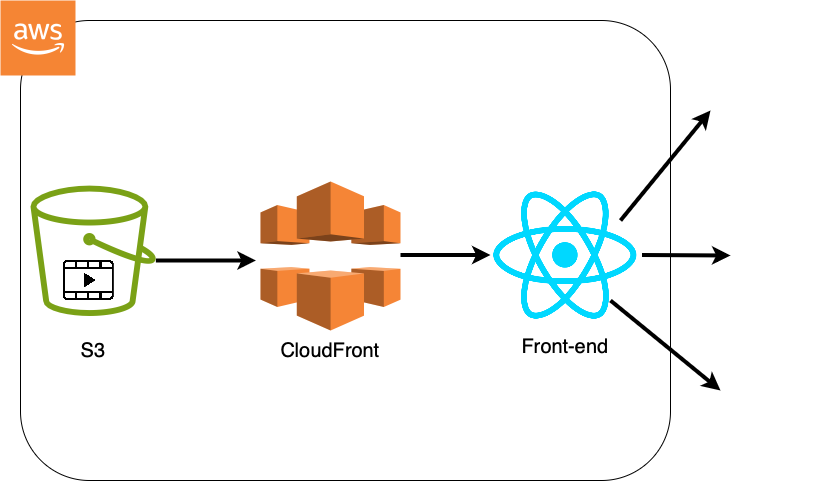

# Video-Streaming-Service

A demo video-streaming web application showcasing secure S3 + CloudFront delivery and a polished React front-end. First, videos are stored in an Amazon S3 bucket with versioning and server-side encryption. CloudFront sits in front—using an Origin Access Control to restrict public access—to deliver content over HTTPS with automatic compression. The React app fetches and plays these videos via the CloudFront URL, and includes a “Watch Trailer” button that conditionally loads the sample video. After the core streaming functionality, the front-end was enhanced with Disney-style branding and responsive CSS to demonstrate advanced JavaScript and styling skills.

## Architecture

  
*(Also available in PDF: `docs/architecture-diagram.pdf`)*

1. **S3 Bucket** (`streamvideo-storage`)  
   - Region: us-east-2  
   - ACLs disabled, public access blocked  
   - Versioning enabled, SSE-S3 encryption  
2. **CloudFront Distribution**  
   - Origin Access Control (`VideoStreaming-OAC`) enforces signed requests  
   - Viewer protocol policy: Redirect HTTP → HTTPS  
   - Automatic object compression  
3. **React Front-end**  
   - Created with Create React App  
   - Header, hero section, “Watch Trailer” button, video player, gallery, and footer  
   - Core code block fetches and plays `Sea_Lions_of_the_Galapagos.mp4` from CloudFront  
   - Styled to mimic a Disneynature page with responsive CSS variables and custom fonts  

## Technologies

- **AWS**: S3, CloudFront, AWS CLI  
- **Frontend**: React, JavaScript (ES6+), CSS (variables, flexbox, grid), Create React App  
- **Dev Tools**: Node.js, npm  

## How It Works

1. **Upload** your video assets to the S3 bucket (`streamvideo-storage`).  
2. **Deploy** a CloudFront distribution with an Origin Access Control so only CloudFront can read from S3.  
3. **Clone** this repo and install dependencies:  
   ```bash
   git clone https://github.com/YOUR_USERNAME/Video-Streaming-Service.git
   cd Video-Streaming-Service/Front-end
   npm install
   npm start

4.	**Interact** in the browser: click “Watch Trailer” to load and play the video via CloudFront.
5.	**Deploy** the production build (npm run build), sync to S3, then run the provided invalidation script to refresh CloudFront caches.   


   ## Project Structure
```plaintext
Video-Streaming-Service/
├── README.md
├── docs/
│   ├── architecture-diagram.png
│   └── architecture-diagram.pdf
└── Front-end/
    ├── .gitignore
    ├── package.json
    ├── node_modules/
    ├── public/
    │   └── (CRA public assets)
    └── src/
        ├── App.js
        ├── App.css
        ├── index.js
        └── index.css


docs/ contains your drawn architecture diagrams in PNG and PDF formats.
Front-end/ holds the React application; src/ is where the key JavaScript and CSS files live.
